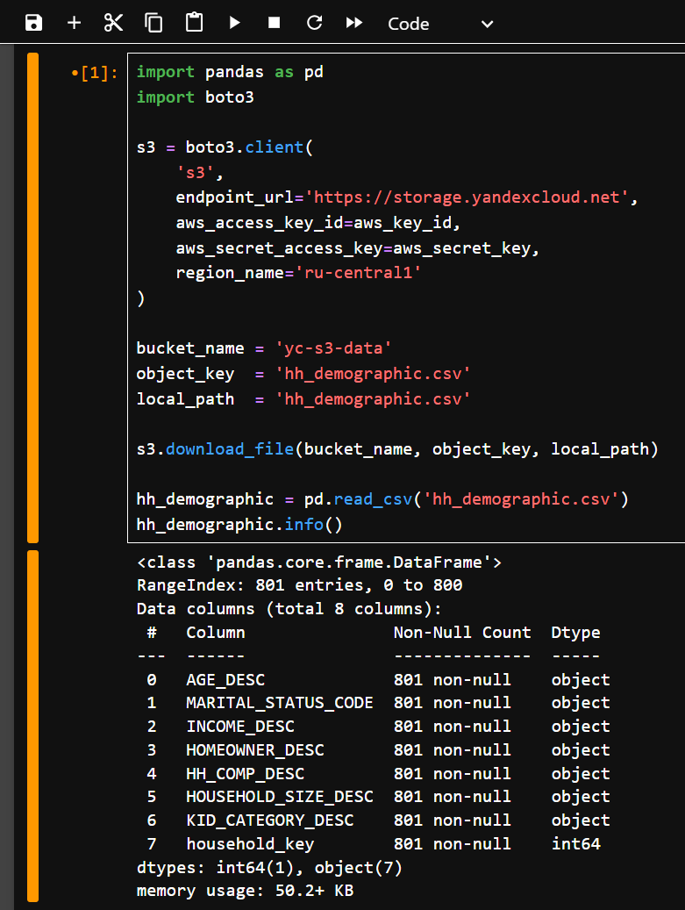
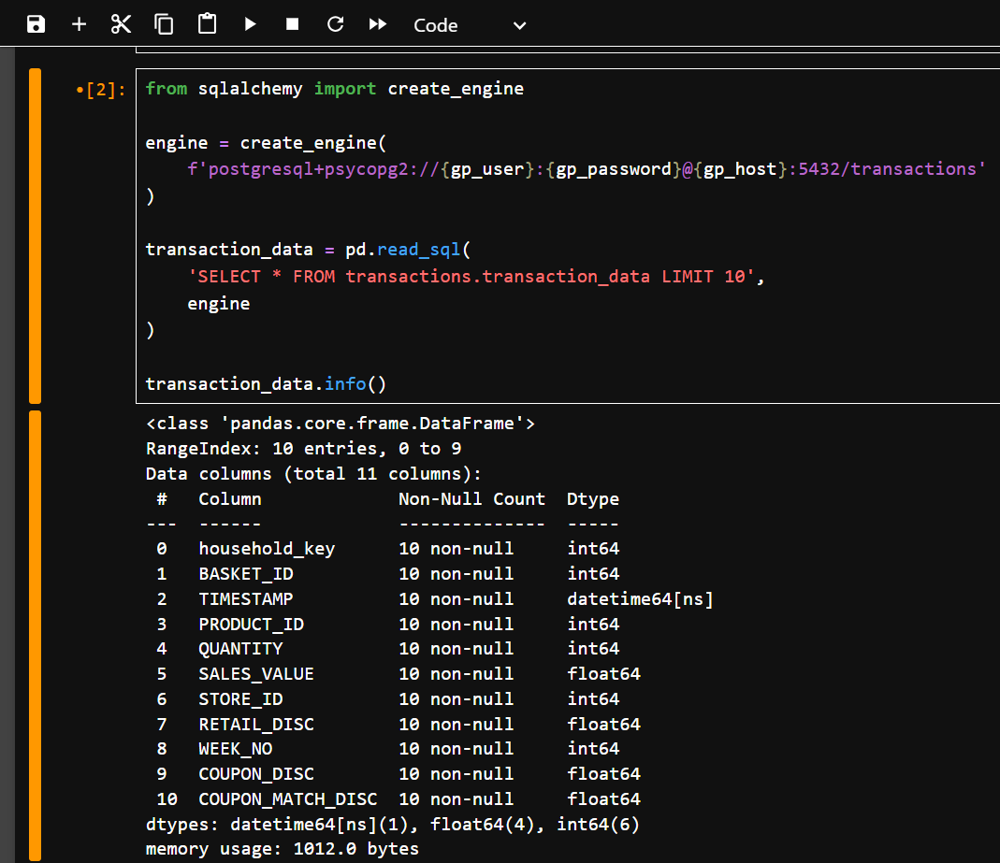
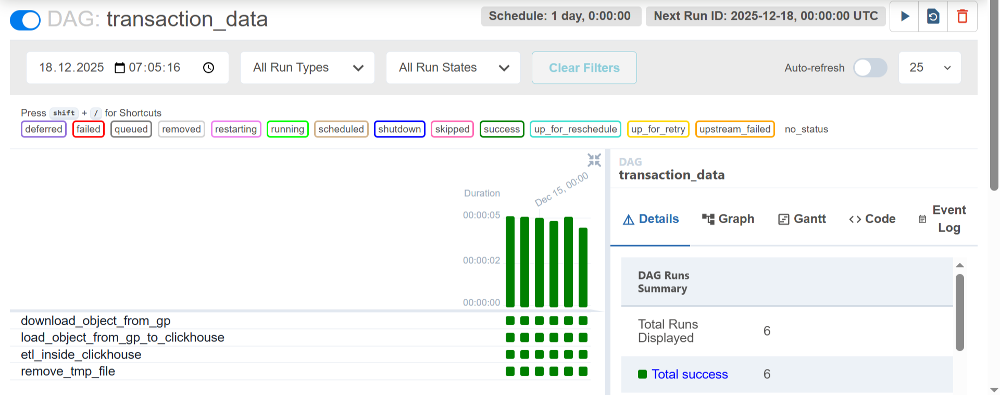
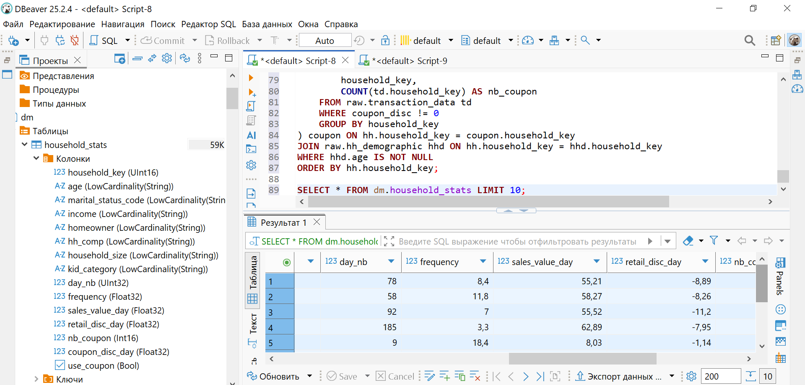
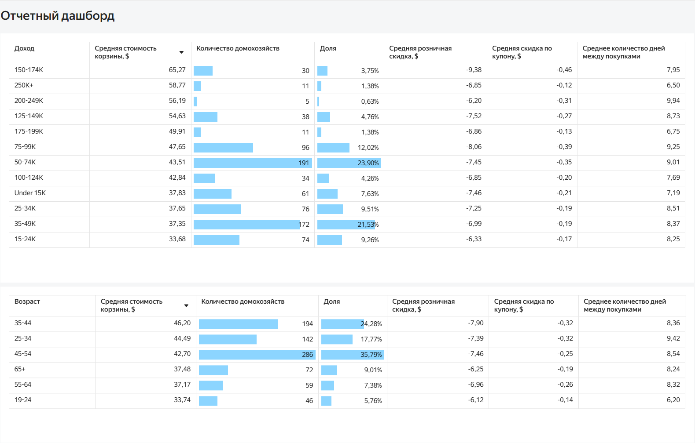
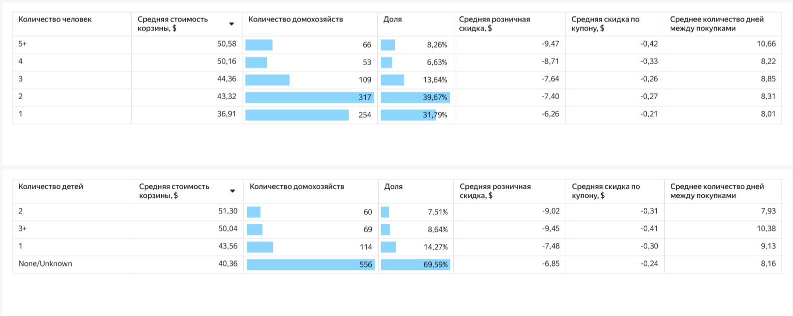
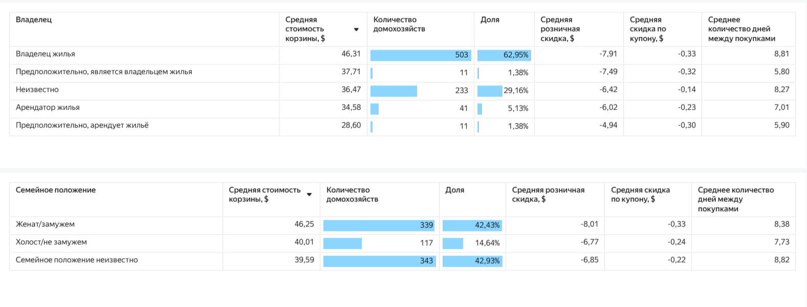

# Клиентская витрина данных

**Данные:**  
Данные сети магазинов товаров повседневного спроса за 2 года.  

hh_demographic - данные о домохозяйствах (данные Яндекс Метрики из S3 в YC):  
- AGE_DESC - возрастная группа
- MARITAL_STATUS_CODE - семейное положение (U — семейное положение неизвестно; A — женат/замужем; B — холост/не замужем)
- INCOME_DESC - доход домохозяйства
- HOMEOWNER_DESC - является ли указанный человек владельцем домохозяйства (Homeowner — владелец жилья; Unknown — неизвестно; Renter — арендатор жилья; Probable Owner — предположительно, является владельцем жилья; Probable Renter — предположительно, арендует жильё)
- HH_COMP_DESC - состав домохозяйства
- HOUSEHOLD_SIZE_DESC - сколько человек входит в домохозяйство
- KID_CATEGORY_DESC - количество детей в домохозяйстве
- household_key - id домохозяйства

transaction_data - данные по транзакциям из Greenplum:  
- household_key - id домохозяйства
- BASKET_ID - id корзины
- TIMESTAMP - временная метка транзакции
- PRODUCT_ID - id товара
- QUANTITY - количество товара
- SALES_VALUE - сумма продажи
- STORE_ID - id магазина
- RETAIL_DISC - сумма розничной скидки
- WEEK_NO - номер недели
- COUPON_DISC - сумма скидки по купону

**Описание:**  
Строим витрину в ClickHouse, импортировав данные из облака Yandex Cloud и Greenplum, настраиваем ETL в Airflow и создаем дашборд в DataLens   

**Структура:**  
1. Постановка задачи
2. Проектирование  
2.1 Изучаем данные в исxодных файлах  
2.2 Создаем слои данных и таблицы в ClickHouse  
3. Разработка  
3.1 Настраиваем ETL в Airflow
3.2 Создаем витрину 
4. Дашборд
5. Выводы

**Стек:**  
Greenplum, Yandex Cloud, Python, Airflow, ClickHouse, DataLens


## 1. Постановка задачи
> Исходя из имеющихся данных необходимо выяснить какие демографические факторы (размер дохода, состав семьи) влияют на расходы покупателей

## 2. Проектирование
#### 2.1 Изучаем данные в исxодных файлах

> подключаемся к S3 в YC и выводим колонки и типы данных


> подключаемся к Greenplum из Python



#### 2.2 Создаем слои данных и таблицы в ClickHouse

> подключаемся к ClickHouse из DBeaver и создаем слои tmp и raw  

```sql
CREATE DATABASE tmp;
CREATE DATABASE raw;
```

> далее создаем таблицы с необходимыми полями и соответсвующими типами данных, выбираем подходящие движки, партицирование и ключ сортировки

```sql
CREATE TABLE tmp.transaction_data(
    household_key Int64,
    BASKET_ID Int64,
    TIMESTAMP String,
    PRODUCT_ID Int64,
    QUANTITY Int64,
    SALES_VALUE Float64,
    STORE_ID Int64,
    RETAIL_DISC Float64,
    WEEK_NO Int64,
    COUPON_DISC Float64,
    COUPON_MATCH_DISC Float64
)
ENGINE = Log;

CREATE TABLE tmp.hh_demographic(
    AGE_DESC String,
    MARITAL_STATUS_CODE String,
    INCOME_DESC String,
    HOMEOWNER_DESC String,
    HH_COMP_DESC String,
    HOUSEHOLD_SIZE_DESC String,
    KID_CATEGORY_DESC String,
    household_key UInt16
)
ENGINE = Log;

CREATE TABLE raw.hh_demographic(
    age String,
    marital_status_code String,
    income String,
    homeowner String,
    hh_comp String,
    household_size String,
    kid_category String,
    household_key UInt16,
    insert_time DateTime, -- время вставки
    hash String -- хеш для всех полей
)
ENGINE = MergeTree()
ORDER BY household_key;

CREATE TABLE raw.transaction_data(
    household_key UInt16,
    basket_id UInt64,
    timestamp DateTime,
    product_id UInt32,
    quantity UInt16,
    sales_value Float32,
    store_id UInt16,
    retail_disc Float32,
    week_no UInt16,
    coupon_disc Float32,
    coupon_match Float32,
    insert_time DateTime,
    hash String
)
ENGINE = MergeTree()
PARTITION BY toYYYYMM(timestamp)
ORDER BY toDate(timestamp);
```
## 3. Разработка
#### 3.1 Настраиваем ETL в Airflow
> создаем DAG для ежедневного скачивания данных из облака в слой tmp, из tmp в raw для hh_demographic
 
```python
# библиотеки
from airflow import DAG
from airflow.operators.python_operator import PythonOperator
import clickhouse_connect
from datetime import datetime, timedelta
import pandas as pd
import boto3
import os

# аргументы
default_args = {
    'owner': 'astmioshenko',
    'start_date': datetime(2025, 12, 12),
    'max_active_runs': 1,
}

# DAG
dag = DAG(
    'hh_demographic',
    default_args=default_args,
    schedule_interval=timedelta(days=1),
)

# скачиваем данные из S3 в YC
def download_object_from_s3():
    session = boto3.session.Session()
    s3 = session.client(
        service_name='s3',
        endpoint_url='https://storage.yandexcloud.net',
        aws_access_key_id=aws_key_id,
        aws_secret_access_key=aws_secret_key,
    )

    s3.download_file(Bucket='yc-s3-data',
        Key='hh_demographic.csv', 
        Filename='/tmp/hh_demographic_downloaded_file.csv')

# загружаем данные в tmp
def load_object_from_s3_to_clickhouse():
    df = pd.read_csv('/tmp/hh_demographic_downloaded_file.csv')

    client  = clickhouse_connect.get_client(
        host=ch_host, 
        port=8443, 
        user=ch_user, 
        password=ch_password,
        verify=False
        )

    client.insert_df('tmp.hh_demographic', df)

# перекладываем данные в слой raw
def etl_inside_clickhouse():

     client  = clickhouse_connect.get_client(
        host=ch_host, 
        port=8443, 
        user=ch_user, 
        password=ch_password,
        verify=False
        )
        
        client.command("""
      TRUNCATE TABLE raw.hh_demographic;
      INSERT INTO raw.hh_demographic
      SELECT 
          AGE_DESC,
          MARITAL_STATUS_CODE,
          INCOME_DESC,
          HOMEOWNER_DESC,
          HH_COMP_DESC,
          HOUSEHOLD_SIZE_DESC,
          KID_CATEGORY_DESC,
          household_key,
          now() as insert_time,
          cityHash64(*) as hash
      FROM tmp.hh_demographic;
      """)

    client.command("TRUNCATE TABLE tmp.hh_demographic")

# удаляем временный файл
def remove_tmp_file():
  os.remove('/tmp/hh_demographic_downloaded_file.csv')

# таски
download_from_s3 = PythonOperator(
    task_id="download_from_s3",
    python_callable=download_object_from_s3,
    dag=dag,
)

load_object_from_s3_to_clickhouse = PythonOperator(
    task_id="load_object_from_s3_to_clickhouse",
    python_callable=load_object_from_s3_to_clickhouse,
    dag=dag,
)

etl_inside_clickhouse= PythonOperator(
    task_id="etl_inside_clickhouse",
    python_callable=etl_inside_clickhouse,
    dag=dag,
)

remove_tmp_file= PythonOperator(
    task_id="remove_tmp_file",
    python_callable=remove_tmp_file,
    dag=dag,
)

# зависимости
download_from_s3 >> load_object_from_s3_to_clickhouse >> etl_inside_clickhouse >> remove_tmp_file
```


> создаем DAG для ежедневного импорта данных из Greenplum в слой tmp, из tmp в raw для transaction_data

```puthon
# библиотеки
from airflow import DAG
from airflow.operators.python_operator import PythonOperator
from sqlalchemy import create_engine
from datetime import datetime, timedelta
import clickhouse_connect
import pandas as pd
import os

# аргументы
default_args = {
   'owner': 'astimoshenko',
   'start_date': datetime(2025, 12, 12),
   'max_active_runs': 1,
}

# DAG
dag = DAG(
   'transaction_data',
   default_args=default_args,
   schedule_interval=timedelta(days=1),
)

# скачиваем данные из GP
def download_object_from_gp(**context):
   engine = create_engine(
       f'postgresql+psycopg2://{gp_user}:{gp_password}@{gp_host}:5432/sample_store')
   data = pd.read_sql(
       f"SELECT * FROM transactions.transaction_data WHERE timestamp::DATE = '{context['ds']}'", engine)
   data.to_csv(f'/tmp/{context["ds"]}-transaction_data_downloaded_file.csv', index=False)

# загружаем данные в слой tmp
def load_object_from_gp_to_clickhouse(**context):
   df = pd.read_csv(f'/tmp/{context["ds"]}-transaction_data_downloaded_file.csv')

   client  = clickhouse_connect.get_client(
       host=ch_host, 
       port=8443, 
       user=ch_user, 
       password=ch_password,
       verify=False
       )

   client.insert_df('tmp.transaction_data', df)

# перекладываем данные в слой raw
def etl_inside_clickhouse():
   client  = clickhouse_connect.get_client(
       host=ch_host, 
       port=8443, 
       user=ch_user, 
       password=ch_password,
       verify=False
       )

   client.command("""
       INSERT INTO raw.transaction_data
       SELECT 
          household_key,
          BASKET_ID,
          toDateTime(TIMESTAMP) AS timestamp,
          PRODUCT_ID,
          QUANTITY,
          SALES_VALUE,
          STORE_ID,
          RETAIL_DISC,
          WEEK_NO,
          COUPON_DISC,
          COUPON_MATCH_DISC, 
          now() AS insert_time,
          cityHash64(*) AS hash
       FROM tmp.transaction_data;
       """)
       
   client.command("TRUNCATE TABLE tmp.transaction_data") # очищаем таблицу

# удаляем временный файл
def remove_tmp_file(**context):
 os.remove(f'/tmp/{context["ds"]}-transaction_data_downloaded_file.csv')

# таски
download_object_from_gp = PythonOperator(
   task_id="download_object_from_gp",
   python_callable=download_object_from_gp,
   dag=dag,
)

load_object_from_gp_to_clickhouse= PythonOperator(
   task_id="load_object_from_gp_to_clickhouse",
   python_callable=load_object_from_gp_to_clickhouse,
   dag=dag,
)

etl_inside_clickhouse= PythonOperator(
   task_id="etl_inside_clickhouse",
   python_callable=etl_inside_clickhouse,
   dag=dag,
)

remove_tmp_file= PythonOperator(
   task_id="remove_tmp_file",
   python_callable=remove_tmp_file,
   dag=dag,
)

# зависимости
download_object_from_gp >> load_object_from_gp_to_clickhouse >> etl_inside_clickhouse >> remove_tmp_file
```


#### 3.2 Создаем витрину

```sql
-- создаем слой витрин
CREATE DATABASE dm;

-- создаем таблицу
CREATE TABLE IF NOT EXISTS dm.household_stats(
    household_key UInt16,
    age LowCardinality(String),
    marital_status_code LowCardinality(String),
    income LowCardinality(String),
    homeowner LowCardinality(String),
    hh_comp LowCardinality(String),
    household_size LowCardinality(String),
    kid_category LowCardinality(String),
    day_nb UInt32,
    frequency Float32,
    sales_value_day Float32,
    retail_disc_day Float32,
    nb_coupon Int16,
    coupon_disc_day Float32,
    use_coupon Boolean
)
ENGINE MergeTree()
Order By household_key;

-- создаем мат представление
CREATE MATERIALIZED VIEW IF NOT EXISTS dm.household_stats_mv 
TO dm.household_stats 
AS SELECT
    hh.household_key,
    hhd.age,
    hhd.marital_status_code,
    hhd.income,
    hhd.homeowner,
    hhd.hh_comp,
    hhd.household_size,
    hhd.kid_category,
    hh.day_nb,
    hh.frequency,
    hh.sales_value_day,
    hh.retail_disc_day,
    COALESCE(coupon.nb_coupon, 0) AS nb_coupon,
    hh.coupon_disc_day,
    hh.use_coupon
FROM (
    SELECT 
        household_key,
        COUNT(DISTINCT timestamp::DATE) AS day_nb,
        ROUND((MAX(timestamp::DATE) - MIN(timestamp::DATE)) / COUNT(DISTINCT timestamp::DATE), 1) AS frequency,
        ROUND(SUM(sales_value) / COUNT(DISTINCT timestamp::DATE), 2) AS sales_value_day,
        ROUND(SUM(retail_disc) / COUNT(DISTINCT timestamp::DATE), 2) AS retail_disc_day,
        ROUND(SUM(coupon_disc) / COUNT(DISTINCT timestamp::DATE), 2) AS coupon_disc_day,
        CASE WHEN SUM(coupon_disc) != 0 THEN TRUE ELSE FALSE END AS use_coupon
    FROM raw.transaction_data
    GROUP BY household_key
) hh
LEFT JOIN (
    SELECT 
        household_key,
        COUNT(td.household_key) AS nb_coupon
    FROM raw.transaction_data td
    WHERE coupon_disc != 0
    GROUP BY household_key
) coupon ON hh.household_key = coupon.household_key
JOIN raw.hh_demographic hhd ON hh.household_key = hhd.household_key
WHERE hhd.age IS NOT NULL
ORDER BY hh.household_key;

--инициируем первую вставку данных
INSERT INTO dm.household_stats 
SELECT
    hh.household_key,
    hhd.age,
    hhd.marital_status_code,
    hhd.income,
    hhd.homeowner,
    hhd.hh_comp,
    hhd.household_size,
    hhd.kid_category,
    hh.day_nb,
    hh.frequency,
    hh.sales_value_day,
    hh.retail_disc_day,
    COALESCE(coupon.nb_coupon, 0) AS nb_coupon,
    hh.coupon_disc_day,
    hh.use_coupon
FROM (
    SELECT 
        household_key,
        COUNT(DISTINCT timestamp::DATE) AS day_nb,
        ROUND((MAX(timestamp::DATE) - MIN(timestamp::DATE)) / COUNT(DISTINCT timestamp::DATE), 1) AS frequency,
        ROUND(SUM(sales_value) / COUNT(DISTINCT timestamp::DATE), 2) AS sales_value_day,
        ROUND(SUM(retail_disc) / COUNT(DISTINCT timestamp::DATE), 2) AS retail_disc_day,
        ROUND(SUM(coupon_disc) / COUNT(DISTINCT timestamp::DATE), 2) AS coupon_disc_day,
        CASE WHEN SUM(coupon_disc) != 0 THEN TRUE ELSE FALSE END AS use_coupon
    FROM raw.transaction_data
    GROUP BY household_key
) hh
LEFT JOIN (
    SELECT 
        household_key,
        COUNT(td.household_key) AS nb_coupon
    FROM raw.transaction_data td
    WHERE coupon_disc != 0
    GROUP BY household_key
) coupon ON hh.household_key = coupon.household_key
JOIN raw.hh_demographic hhd ON hh.household_key = hhd.household_key
WHERE hhd.age IS NOT NULL
ORDER BY hh.household_key;
```


# 4. Дашборд
> на основе витрины создаем дашборд в DataLens




# 5. Выводы
- у категории владельцев с большим доходом средняя стоимость покупок выше, но ~ 45% домохозяйств с доходом 35-75к;
- преобладающая группа покупателей - это домовладельцы в возрастной группе 45–54 лет, а наибольшая средняя стоимость покупок у людей 25–34 и 35–44 лет;
- чем больше человек и детей в домохозяйстве, тем выше средняя стоимость корзины, но ~70% состоят из одного или двух человек и не имею детей или нет сведений;
- владельцы жилья преобладают и тратят больше всех;
- чаще совершают покупки и затраты выше у домовладельцев со статусом "Замужем/женат".
