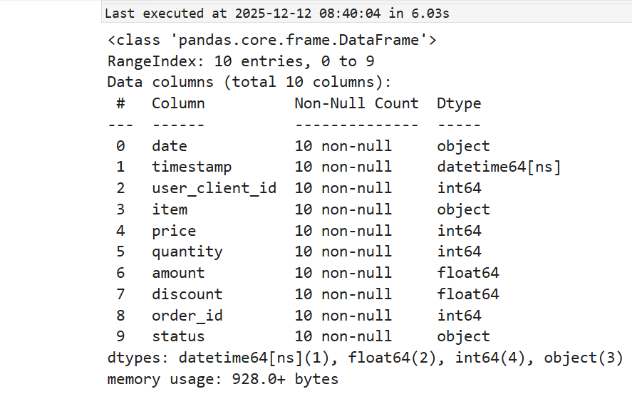
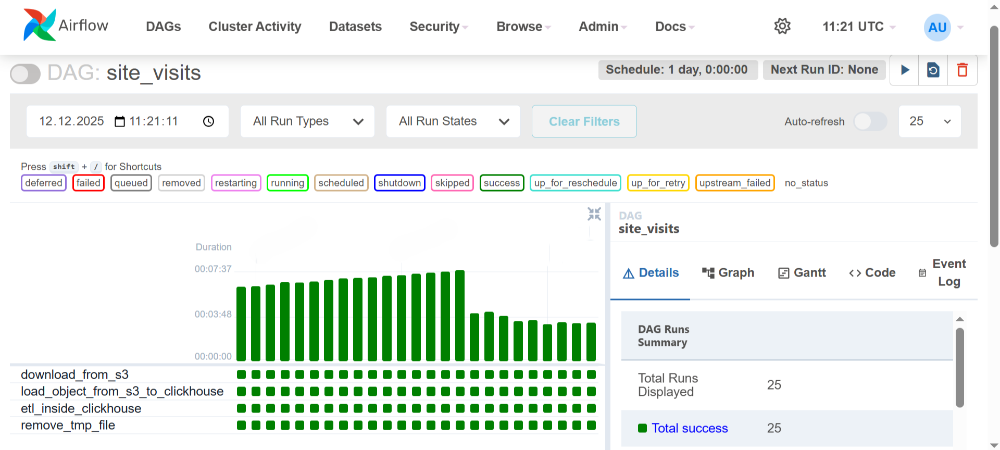
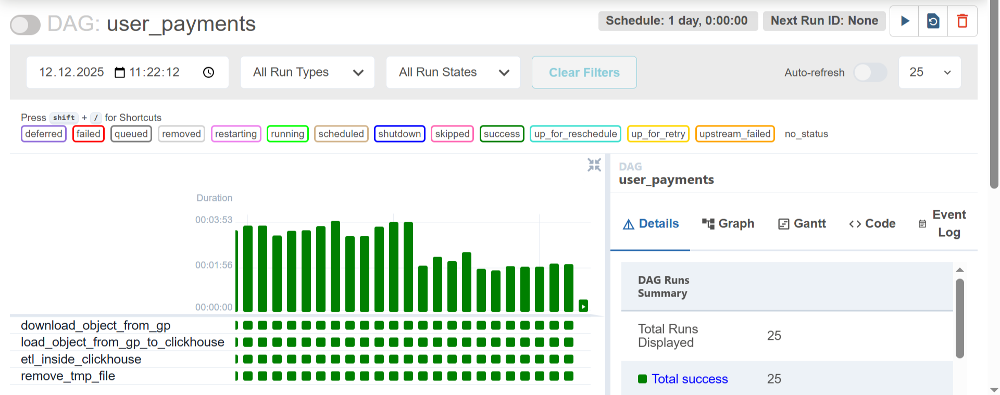
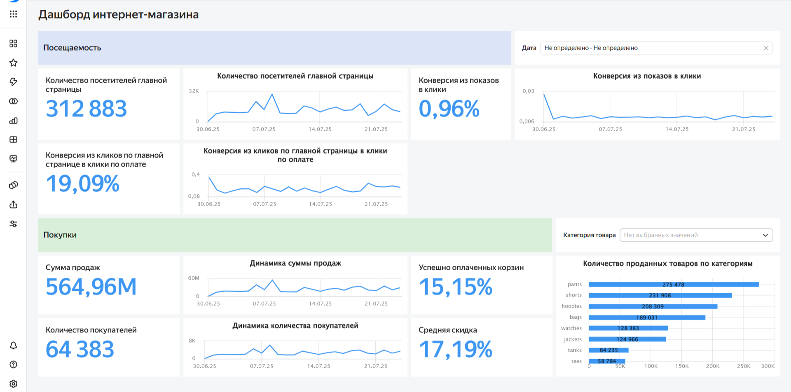

# Маркетинговая витрина данных

**Данные:**  
Искусственные данные за период с 2025-06-30 по 2025-07-24.  

site_visits - данные о посещении сайта (данные Яндекс Метрики из S3 в YC):  
- date — дата действия
- timestamp — временная метка действия
- user_client_id — id клиента
- action_type — тип действия
- placement_type — место на странице сайта, с которым было произведено действие
- placement_id — id места на странице сайта
- user_visit_url — полный адрес страницы сайта

user_payments - данные по транзакциям из Greenplum:  
- date — дата действия
- timestamp — временная метка
- user_client_id — id клиента
- item — приобретаемый товар
- price — цена за единицу товара
- amount — итоговая стоимость за количество позиций с учётом скидки
- discount — скидка в процентах от изначальной цены товара
- order_id — id заказа пользователя
- status — статус оплаты товара

**Описание:**  
Построим витрину в ClickHouse, импортировав данные из облака Yandex Cloud и Greenplum, настроим ETL в Airflow и создадим дашборд в DataLens   

**Структура:**  
1. Постановка задачи
2. Проектирование  
2.1 Изучаем данные в исxодных файлах  
2.2 Создаем слои данных и таблицы в ClickHouse  
3. Разработка  
3.1 Настраиваем ETL в Airflow
3.2 Создаем витрины  
4. Дашборд

**Стек:**  
Greenplum, Yandex Cloud, Python, Airflow, ClickHouse, DataLens


## 1. Постановка задачи
> Для задач маркетинга необходимо ответить на вопросы:  
сколько людей посетило главную страницу, какая средняя конверсия из главной страницы в покупку, а также из показов в клики, какая общая сумма продаж, какое общее количество уникальных покупателей, какой средний процент успешно оплаченных корзин от сформированных, товары каких категорий добавляли больше всего за весь период. 

## 2. Проектирование
#### 2.1 Изучаем данные в исxодных файлах
> подключаемся к Greenplum из Python и выводим колонки и типы данных
 
```python
from sqlalchemy import create_engine
import pandas as pd

engine = create_engine(
    f'postgresql+psycopg2://{gp_user}:{gp_password}@{gp_host}:5432/sample_store'
)

user_payments = pd.read_sql(
    'SELECT * FROM sample_store.user_payments LIMIT 10',
    engine
)

user_payments.info()
```



> подключаемся к S3 в YC
 
```python
import boto3

s3 = boto3.client(
    's3',
    endpoint_url='https://storage.yandexcloud.net',
    aws_access_key_id=aws_key_id,
    aws_secret_access_key=aws_secret_key,
    region_name='ru-central1'
)

bucket_name = 'yc-metrics-theme'
object_key  = '2025-06-30-site-visits.csv'
local_path  = '2025-06-30-site-visits.csv'

s3.download_file(bucket_name, object_key, local_path)

site_visits = pd.read_csv('2025-06-30-site-visits.csv')
site_visits.info()
```


#### 2.2 Создаем слои данных и таблицы в ClickHouse
> подключаемся к ClickHouse из DBeaver и создаем слои tmp(временный) и raw(сырой)  

```sql
CREATE DATABASE tmp;
CREATE DATABASE raw;
```

> далее создаем таблицы с необходимыми полями и соответсвующими типами данных, выбираем подходящие движки, партицирование и ключ сортировки

```sql
CREATE TABLE tmp.site_visits  (
    date String,
    timestamp String,
    user_client_id Int64,
    action_type String,
    placement_type String,
    placement_id Int64,
    user_visit_url String
) ENGINE = Log; -- подходит для временного хранения

CREATE TABLE tmp.user_payments (
    date String,
    timestamp String,
    user_client_id Int64,
    item String,
    price Int64,
    quantity Int64,
    amount Float64,
    discount Float64,
    order_id Int64,
    status String
) ENGINE = Log;

CREATE TABLE raw.site_visits (
    date DateTime,
    timestamp DateTime,
    user_client_id Int64,
    action_type String,
    placement_type String,
    placement_id Int64,
    user_visit_url String,
    insert_time DateTime, -- время вставки
    hash String -- хеш для всех полей
) ENGINE = MergeTree()
PARTITION BY toYYYYMM(date) -- партиции
ORDER BY date; -- и ключ сортировки по дате

CREATE TABLE raw.user_payments(
    date DateTime,
    timestamp DateTime,
    user_client_id Int64,
    item String,
    price Int64,
    quantity Int64,
    amount Float64,
    discount Float64,
    order_id Int64,
    status String,
    insert_time DateTime,
    hash String
) ENGINE = MergeTree()
PARTITION BY toYYYYMM(date)
ORDER BY date;
```

## 3. Разработка
#### 3.1 Настраиваем ETL в Airflow
> создаем DAG для ежедневного скачивания данных из облака в слой tmp, из tmp в raw с преобразованием и обогащением для site_visits
 
```python
# библиотеки
from airflow import DAG
from airflow.operators.python_operator import PythonOperator
import clickhouse_connect
from datetime import datetime, timedelta
import pandas as pd
import boto3
import os

# аргументы
default_args = {
    'owner': 'astmioshenko',
    'start_date': datetime(2025, 6, 30),
    'end_date': datetime(2025, 7, 26),
    'max_active_runs': 1,
}

# DAG
dag = DAG(
    'site_visits',
    default_args=default_args,
    schedule_interval=timedelta(days=1),
)

# скачиваем данные из S3 в YC
def download_object_from_s3(**context):
    session = boto3.session.Session()
    s3 = session.client(
        service_name='s3',
        endpoint_url='https://storage.yandexcloud.net',
        aws_access_key_id=aws_key_id,
        aws_secret_access_key=aws_secret_key,
    )

    s3.download_file(Bucket='yc-metrics-theme',
        Key=f'{context["ds"]}-site-visits.csv', 
        Filename=f'/tmp/{context["ds"]}-site_visits_downloaded_file.csv')

# загружаем данные в tmp
def load_object_from_s3_to_clickhouse(**context):
    df = pd.read_csv(f'/tmp/{context["ds"]}-site_visits_downloaded_file.csv')

    client  = clickhouse_connect.get_client(
        host=host, 
        port=8443, 
        user=user, 
        password=password,
        verify=False
        )

    client.insert_df('tmp.site_visits', df)

# перекладываем данные в слой raw
def etl_inside_clickhouse(**context):

     client  = clickhouse_connect.get_client(
        host=host, 
        port=8443, 
        user=user, 
        password=password,
        verify=False
        )
        
        client.command(f"""
      INSERT INTO raw.site_visits 
      SELECT 
        toDateTime(date) as date,
        toDateTime(timestamp) as timestamp,
        user_client_id,
        action_type,
        placement_type,
        placement_id,
        user_visit_url, 
        now() as insert_time,
        cityHash64(*) as hash
      FROM tmp.site_visits 
      WHERE date = '{context["ds"]}'
      """)

def remove_tmp_file(**context):
  os.remove(f'/tmp/{context["ds"]}-site_visits_downloaded_file.csv')

# таски
download_from_s3 = PythonOperator(
    task_id="download_from_s3",
    python_callable=download_object_from_s3,
    dag=dag,
)

load_object_from_s3_to_clickhouse = PythonOperator(
    task_id="load_object_from_s3_to_clickhouse",
    python_callable=load_object_from_s3_to_clickhouse,
    dag=dag,
)

etl_inside_clickhouse= PythonOperator(
    task_id="etl_inside_clickhouse",
    python_callable=etl_inside_clickhouse,
    dag=dag,
)

remove_tmp_file= PythonOperator(
    task_id="remove_tmp_file",
    python_callable=remove_tmp_file,
    dag=dag,
)

# зависимости
download_from_s3 >> load_object_from_s3_to_clickhouse >> etl_inside_clickhouse >> remove_tmp_file
```

> создаем DAG для ежедневного импорта данных из Greenplum в слой tmp, из tmp в raw с преобразованием и обогащением для user_payments

 ```python
# библиотеки
from airflow import DAG
from airflow.operators.python_operator import PythonOperator
from sqlalchemy import create_engine
from datetime import datetime, timedelta
import clickhouse_connect
import pandas as pd
import os

# аргументы
default_args = {
    'owner': 'astimoshenko',
    'start_date': datetime(2025, 6, 30),
    'end_date': datetime(2025, 7, 26),
    'max_active_runs': 1,
}

# DAG
dag = DAG(
    'user_payments',
    default_args=default_args,
    schedule_interval=timedelta(days=1),
)

# скачиваем данные из GP
def download_object_from_gp(**context):
    engine = create_engine('postgresql+psycopg2://{gp_user}:{gp_password}@{gp_host}:5432/sample_store')
    data = pd.read_sql(f"SELECT * FROM sample_store.user_payments WHERE date = '{context['ds']}'", engine)
    data.to_csv(f'/tmp/{context["ds"]}-user_payments_downloaded_file.csv', index=False)

# загружаем данные в слой tmp
def load_object_from_gp_to_clickhouse(**context):
    df = pd.read_csv(f'/tmp/{context["ds"]}-user_payments_downloaded_file.csv')

    client  = clickhouse_connect.get_client(
        host=host, 
        port=8443, 
        user=user, 
        password=password,
        verify=False
        )

    client.insert_df('tmp.user_payments', df)

# перекладываем данные в слой raw
def etl_inside_clickhouse():
    client  = clickhouse_connect.get_client(
        host=host, 
        port=8443, 
        user=user, 
        password=password,
        verify=False
        )

    client.command("""
        INSERT INTO raw.user_payments
        SELECT 
          toDateTime(date) as date,
          toDateTime(timestamp),
          user_client_id,
          item,
          price,
          quantity,
          amount,
          discount,
          order_id,
          status, 
          now() as insert_time,
          cityHash64(*) as hash
          FROM tmp.user_payments
        """)
        
    client.command("TRUNCATE TABLE tmp.user_payments") # Очистка временной таблицы

def remove_tmp_file(**context):
  os.remove(f'/tmp/{context["ds"]}-user_payments_downloaded_file.csv')

# таски
download_object_from_gp = PythonOperator(
    task_id="download_object_from_gp",
    python_callable=download_object_from_gp,
    dag=dag,
)

load_object_from_gp_to_clickhouse= PythonOperator(
    task_id="load_object_from_gp_to_clickhouse",
    python_callable=load_object_from_gp_to_clickhouse,
    dag=dag,
)

etl_inside_clickhouse= PythonOperator(
    task_id="etl_inside_clickhouse",
    python_callable=etl_inside_clickhouse,
    dag=dag,
)

remove_tmp_file= PythonOperator(
    task_id="remove_tmp_file",
    python_callable=remove_tmp_file,
    dag=dag,
)

# зависимости
download_object_from_gp >> load_object_from_gp_to_clickhouse >> etl_inside_clickhouse >> remove_tmp_file
```



#### 3.2 Создаем витрины 
> Создадим слой для витрин и сами таблицы. Будем использовать материализованные представления, чтобы витрины автоматически обновлялись при добавлении новых данных из слоя raw, благодаря особенности ClickHouse
 
```sql
CREATE DATABASE dm;

-- витрина по клиентам
CREATE TABLE IF NOT EXISTS dm.user_visits(
    date Date,
    action_type LowCardinality(String),
    placement_type LowCardinality(String),
    user_visit_url String,
    cnt_uniq_users UInt32, -- кол-во уникальных клиентов
    cnt_actions UInt32 -- кол-во действий
) ENGINE = SummingMergeTree
ORDER BY (date, action_type, placement_type, user_visit_url);

-- мат представление
CREATE MATERIALIZED VIEW IF NOT EXISTS dm.user_visits_mv 
TO dm.user_visits AS
SELECT
  toDate(date) AS date,
  action_type,
  placement_type,
  user_visit_url,
  COUNT(distinct user_client_id) AS cnt_uniq_users,
  COUNT(user_client_id) AS cnt_actions
FROM raw.site_visits
GROUP BY date, action_type, placement_type, user_visit_url;

-- инициируем вставку имеющихся данных в витрину
INSERT INTO dm.user_visits 
SELECT
  toDate(date) AS date,
  action_type,
  placement_type,
  user_visit_url,
  COUNT(distinct user_client_id) AS cnt_uniq_users,
  COUNT(user_client_id) AS cnt_actions
FROM raw.site_visits
GROUP BY date, action_type, placement_type, user_visit_url;


-- витрина по заказам
CREATE TABLE IF NOT EXISTS dm.item_payments(
  date Date,
  item LowCardinality(String),
  status LowCardinality(String),
  total_amount Float32,
  total_quantity UInt32,
  total_discount Float32,
  cnt_uniq_users UInt16,
  cnt_statuses UInt16
) ENGINE = SummingMergeTree
ORDER BY (date, item, status);

-- мат представление
CREATE MATERIALIZED VIEW IF NOT EXISTS dm.item_payments_mv 
TO dm.item_payments AS
SELECT
  toDate(date) AS date,
  item,
  status,
  SUM(amount) AS total_amount,
  SUM(quantity) AS total_quantity,
  SUM(price*quantity) - SUM(amount) AS total_discount,
  COUNT(distinct user_client_id) AS cnt_uniq_users,
  COUNT(user_client_id) AS cnt_statuses
FROM raw.user_payments
GROUP BY date, item, status;

-- инициируем вставку данных
INSERT INTO dm.item_payments 
SELECT
  toDate(date) AS date,
  item,
  status,
  SUM(amount) AS total_amount,
  SUM(quantity) AS total_quantity,
  SUM(price*quantity) - SUM(amount) AS total_discount,
  COUNT(DISTINCT user_client_id) AS cnt_uniq_users,
  COUNT(user_client_id) AS cnt_statuses
FROM raw.user_payments
GROUP BY date, item, status;
```

## 4. Дашборд


[https://datalens.ru/0kky1tuvza0yl]  


